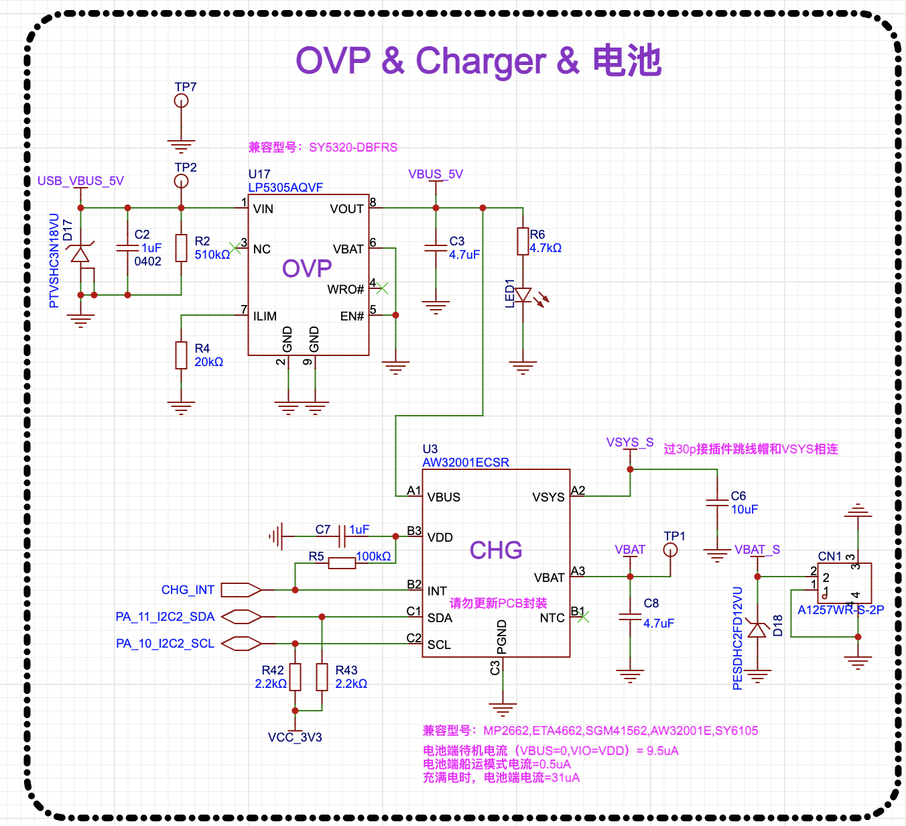
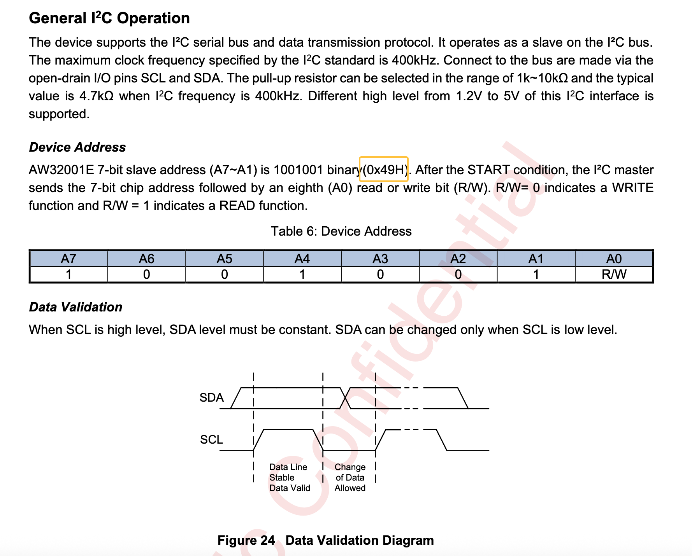
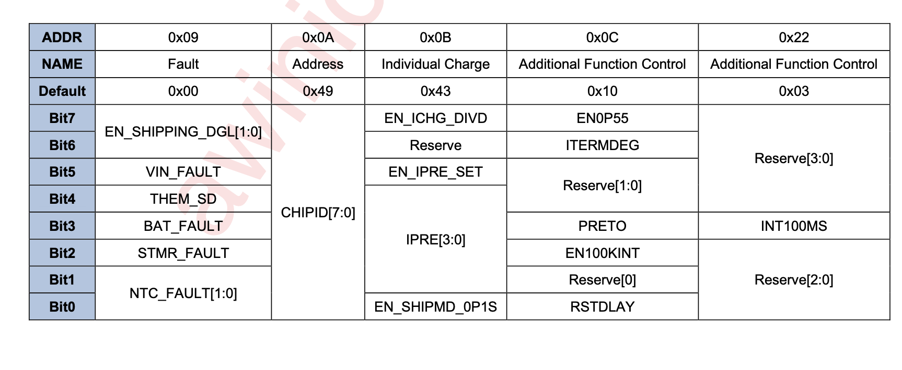
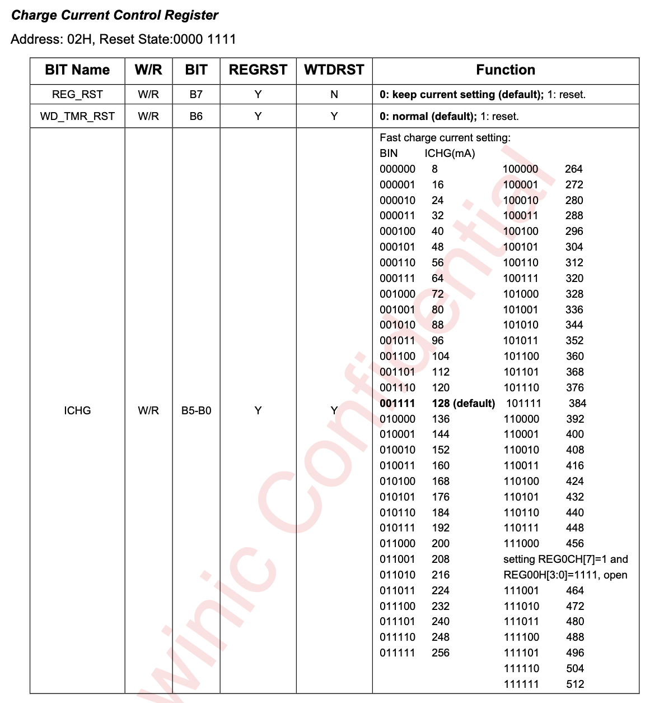

# I2C 外设示例

I2C（Inter-Integrated Circuit）总线是一种重要的串行通信协议，它的历史可以追溯到上世纪80年代初期。I2C在很多嵌入式系统中被广泛使用，尤其是在传感器、存储器和其他外围设备之间的通信。I2C总线的设计初衷是为了简化多芯片系统中的通信，减少布线复杂度，提高数据传输效率。

在立创黄山派中，板载了很多I2C外设，例如六轴传感器、光照传感器、充电IC等都是通过I2C总线与MCU进行通信的。在本次示例中，我们将以控制充电IC为例子。

## I2C API介绍

SiFli-SDK 目前基于 RT-Thread，因此外设方面API与RT-Thread 保持一致。详细的API使用说明可以参考 [RT-Thread I2C API](https://www.rt-thread.org/document/site/#/rt-thread-version/rt-thread-standard/programming-manual/device/i2c/i2c) 文档。在接下来的示例中，我们会逐步讲解每个API的使用方法。

## 硬件连接

我们查看一下立创黄山派的原理图，发现使用的充电IC是`AW32001`，SCL和SDA分别连接到MCU的`PA10`和`PA11`引脚上，并且外设总线使用的是`I2C2`。



查看AW32001的手册，我们得知它的**7-bit**地址是`0x49`，因此我们在代码中有如下定义。



```c
static const uint8_t AW32001_ADDRESS = 0x49; // 7-bit I2C address for AW32001
static const char *I2C_BUS_NAME = "i2c2";
```

## 初始化总线

想要初始化总线，我们需要一个初始化函数，在工程中我们有如下代码：

```c
static bool i2c_init(struct rt_i2c_bus_device **bus) {
  *bus = rt_i2c_bus_device_find(I2C_BUS_NAME);
  if (*bus == RT_NULL) {
    LOG_E("I2C bus not found");
    return false;
  }
  rt_kprintf("I2C bus found success\n");

  rt_device_open((rt_device_t)(*bus), RT_DEVICE_FLAG_RDWR);
  rt_kprintf("I2C bus opened success\n");
  struct rt_i2c_configuration configuration = {
      .mode = 0,
      .addr = 0,
      .timeout = 500,   // Waiting for timeout period (ms)
      .max_hz = 400000, // I2C rate (hz)
  };

  rt_i2c_configure(*bus, &configuration);

  rt_kprintf("I2C bus configured success\n");
  return true;
}
```

在这个函数中，我们首先通过`rt_i2c_bus_device_find`函数查找I2C总线设备，如果查找不到，`*bus`将会是`RT_NULL`，我们打印错误信息并返回`false`。另外这种提前返回的方式我们将其称之为`卫语句`，它可以帮助我们减少代码的嵌套层级，提高代码的可读性，后续中会多次使用。

接下来我们需要打开I2C总线设备，这里我们使用`rt_device_open`，其中第二个参数代表我们这个设备是`读写`类型的，更多的使用方法可以参考 [RT-Thread 访问-io-设备](https://www.rt-thread.org/document/site/#/rt-thread-version/rt-thread-standard/programming-manual/device/device?id=%e8%ae%bf%e9%97%ae-io-%e8%ae%be%e5%a4%87)。

再接下来我们需要配置I2C总线的参数，这里我们使用`rt_i2c_configure`函数进行配置。我们可以设置I2C的工作模式、地址、超时时间和速率等参数。这里我们设置了I2C的速率为400KHz，超时时间为500ms。

mode参数为设置7bit地址模式还是10bit模式，我们在此只需要7bit，因此设置为0。如果需要使用10bit地址模式，则应当设置为`RT_I2C_ADDR_10BIT`。

addr参数则为从机模式下的设备地址，我们使用的是主机模式，因此忽略，可设置为0。

至此，I2C总线的初始化工作已经完成，我们可以开始进行数据的读写操作了。

### 硬件配置

另外你可能会感到好奇，在上述的操作中我们并没有对具体的引脚进行配置，仅仅只有总线的名称，那rtt是怎么知道我们要用哪个引脚呢？其实这是因为在bsp中就已经进行了配置，在main函数之前就已经进行了初始化。具体的源码路径在`$SDK_PATH/customer/boards/yellow_mountain_base/bsp_pinmux.c`中，查找注释为`I2C2 (charger)`即可看到。

```c
// I2C2 (charger)
HAL_PIN_Set(PAD_PA10, I2C2_SCL, PIN_PULLUP, 1);
HAL_PIN_Set(PAD_PA11, I2C2_SDA, PIN_PULLUP, 1);
```

另外如果我们想要使用其他的引脚，只需要在设备open之前调用`HAL_PIN_Set`函数进行设置即可。

## 扫描I2C总线

众所周知，每个I2C设备都有一个地址，之前我们查询到AW32001的地址是`0x49`，但是如果我们并不知道这个地址怎么办呢？我们可以通过扫描I2C总线来获取所有连接在总线上的设备地址。

```c
static void scan_i2c_devices(struct rt_i2c_bus_device** bus)
{
  rt_uint8_t        buf[1];
  struct rt_i2c_msg msg;

  msg.addr  = AW32001_ADDRESS;
  msg.flags = RT_I2C_RD; /* 读标志，底层会先发从机地址 + R/W = R */
  msg.buf   = buf;       /* 接收一个字节（不用在意接收到的值）*/
  msg.len   = 1;

  for (rt_uint8_t addr = 0x03; addr <= 0x77; addr++)
  {
    /* 只做一次字节的读操作来检测 ACK */
    msg.addr  = addr;
    msg.flags = RT_I2C_RD; /* 读标志，底层会先发从机地址 + R/W = R */
    msg.buf   = buf;       /* 接收一个字节（不用在意接收到的值）*/
    msg.len   = 1;

    rt_int32_t ret = rt_i2c_transfer(*bus, &msg, 1);
    if (ret == 1)
    {
      /* 设备有响应 */
      rt_kprintf("Find I2C device at address 0x%02X\n", addr);
    }
  }
}
```

在这个函数中，我们使用了一个循环，从`0x03`到`0x77`依次扫描每个地址。我们将`msg.addr`设置为当前的地址，然后调用`rt_i2c_transfer`函数进行数据的传输。如果返回值为1，则表示该地址上有设备响应，我们打印出设备的地址。

需要注意的是，I2C的地址范围是`0x03`到`0x77`，其中`0x00`和`0x01`是保留地址，不能使用。

## 读写设备寄存器

现在总线已经初始化完成，我们可以开始读写寄存器了。从AW32001的手册中可以查询到它有一个CHIPID，地址为`0x0A`，默认值应当是`0x49`。



因此我们有如下代码：

```c
static void read_chip_id(struct rt_i2c_bus_device **bus) {
  rt_uint8_t buf[1];
  struct rt_i2c_msg msg;
  rt_int32_t ret;

  msg.addr = AW32001_ADDRESS;
  msg.flags = RT_I2C_WR;
  msg.buf = buf;
  msg.len = 1;
  buf[0] = 0x0A; // AW32001 chip ID register address

  ret = rt_i2c_transfer(*bus, &msg, 1);
  if (ret != 1) {
    LOG_E("Failed to write to I2C device");
    return;
  }
  msg.flags = RT_I2C_RD;

  ret = rt_i2c_transfer(*bus, &msg, 1);
  if (ret != 1) {
    LOG_E("Failed to read from I2C device");
    return;
  }
  rt_kprintf("AW32001 chip ID: 0x%02X\n", buf[0]);
}
```

在这个函数中，我们首先定义了一个`buf`数组，用于存储要写入的寄存器地址和读取到的数据。接下来我们定义了一个`rt_i2c_msg`结构体，用于描述I2C消息。
`rt_i2c_msg`结构体中有几个重要的字段：
- `addr`：从机地址
- `flags`：读写标志位，有如下几个选项，也可参考<https://www.rt-thread.org/document/site/#/rt-thread-version/rt-thread-standard/programming-manual/device/i2c/i2c?id=%e6%95%b0%e6%8d%ae%e4%bc%a0%e8%be%93>
```c
#define RT_I2C_WR              0x0000        /* 写标志，不可以和读标志进行“|”操作 */
#define RT_I2C_RD              (1u << 0)     /* 读标志，不可以和写标志进行“|”操作 */
#define RT_I2C_ADDR_10BIT      (1u << 2)     /* 10 位地址模式 */
#define RT_I2C_NO_START        (1u << 4)     /* 无开始条件 */
#define RT_I2C_IGNORE_NACK     (1u << 5)     /* 忽视 NACK */
#define RT_I2C_NO_READ_ACK     (1u << 6)     /* 读的时候不发送 ACK */
#define RT_I2C_NO_STOP         (1u << 7)     /* 不发送结束位 */
```
- `buf`：数据缓冲区
- `len`：数据长度

接下来我们需要写入需要读取的目标寄存器地址，这里我们将其设置为`0x0A`，然后调用`rt_i2c_transfer`函数进行数据的传输。这个函数的第一个参数是I2C总线设备，第二个参数是I2C消息结构体，第三个参数是消息的数量。返回值是成功传输的消息数量，如果返回值不等于1，则表示写入失败，我们打印错误信息并返回。
接下来我们需要设置`msg.flags`为`RT_I2C_RD`，表示我们要进行读取操作。然后再次调用`rt_i2c_transfer`函数进行数据的传输，这次我们只需要读取1个字节的数据，因此第三个参数设置为1。如果返回值不等于1，则表示读取失败，我们打印错误信息并返回。
最后我们打印读取到的芯片ID。

### 更简单的封装

上述的操作可以看得出非常繁琐，我们需要先写入寄存器地址后才能开始读取，那么有没有更简单的方法呢？

有的有的，在SiFli-SDK中，我们封装了对应的`rt_i2c_mem_read`和`rt_i2c_mem_write`函数，来简化这个过程。我们可以直接使用这两个函数进行读写操作。

接下来我们看下这两个函数的签名：

```c
rt_size_t rt_i2c_mem_read(struct rt_i2c_bus_device *bus,
                          rt_uint16_t dev_addr,
                          rt_uint16_t mem_addr,
                          rt_uint16_t mem_addr_size,
                          void       *buffer,
                          rt_size_t   count);

rt_size_t rt_i2c_mem_write(struct rt_i2c_bus_device *bus,
                           rt_uint16_t dev_addr,
                           rt_uint16_t mem_addr,
                           rt_uint16_t mem_addr_size,
                           void       *buffer,
                           rt_size_t   count);
```

这两个函数的参数如下：
- `bus`：I2C总线设备
- `dev_addr`：从机地址
- `mem_addr`：寄存器地址
- `mem_addr_size`：寄存器地址大小，8代表1字节，16代表2字节，一般都传入8即可
- `buffer`：数据缓冲区
- `count`：数据长度，单位为字节
- 返回值：成功传输的字节数

我们可以使用这两个函数来简化我们的代码，例如我们可以将上面的读取芯片ID的代码改为如下：

```c
static void read_chip_id_simple(struct rt_i2c_bus_device **bus) {
  rt_uint8_t buf[1];
  rt_int32_t ret = rt_i2c_mem_read(*bus, AW32001_ADDRESS, 0x0A, 8, buf, 1);
  if (ret != 1) {
    LOG_E("Failed to read from I2C device");
    return;
  }
  rt_kprintf("AW32001 chip ID: 0x%02X\n", buf[0]);
}
```

怎么样，是不是简单多了？在后续的代码中，我们也会使用这种方式进行读写操作。

## 设置充电电流

继续查看AW32001的手册，我们可以看到它有一个充电电流寄存器，地址为`0x02`。



另外需要注意的是，充电电流也就是 ICHG，并没有填满整个字节，而是仅仅占用了bit0-bit5，因此在后续的操作中，我们需要将其与`0x3F`(也就是0b111111)进行`&`操作，来确保我们只设置了这6位。

接下来我们有如下代码：

```c
static void write_charge_current(struct rt_i2c_bus_device **bus,
                                 uint8_t current) {
  const uint8_t CHARGE_CURRENT_ADDRESS = 0x02;
  rt_uint8_t buf[1];
  rt_int32_t ret;
  ret =
      rt_i2c_mem_read(*bus, AW32001_ADDRESS, CHARGE_CURRENT_ADDRESS, 8, buf, 1);
  if (ret != 1) {
    LOG_E("Failed to read from I2C device");
    return;
  }
  // current: bit0-bit5
  buf[0] = (buf[0] & 0xC0) | (current & 0x3F);
  ret = rt_i2c_mem_write(*bus, AW32001_ADDRESS, CHARGE_CURRENT_ADDRESS, 8, buf,
                         1);
  if (ret != 1) {
    LOG_E("Failed to write to I2C device");
    return;
  }
  rt_kprintf("AW32001 charge current set to: 0x%02X\n", buf[0]);
}
```

这段代码的含义不多赘述，唯一需要注意的是`buf[0] = (buf[0] & 0xC0) | (current & 0x3F);`这一句。`(buf[0] & 0xC0)`是将原来的值的高两位保留，`(current & 0x3F)`是将当前值的低六位保留，最后将两者进行`|`操作，得到新的值。这样就可以确保我们只修改了低六位的值，而不影响高两位的值。

最后我们将新的值写入到寄存器中即可。

## 查看效果

最后我们在while 1循环中实现一个简单的效果，从0开始逐渐增加充电电流，每次停留100ms。

```c
uint8_t charge_current = 0;
/* Infinite loop */
while (1) {
    charge_current++;
    if (charge_current > 0x1F) {
        charge_current = 0;
    }
    write_charge_current(&i2c_bus, charge_current);
    rt_thread_mdelay(100);
}
```

最终我们用外部功耗表测量电流曲线，观察到的效果如下：


可以看到，充电电流是逐渐增加的，说明我们对充电IC的控制是成功的。

需要注意的是，这个效果最好使用电池电量较低的时候进行，否则充电电流变化并不明显。
