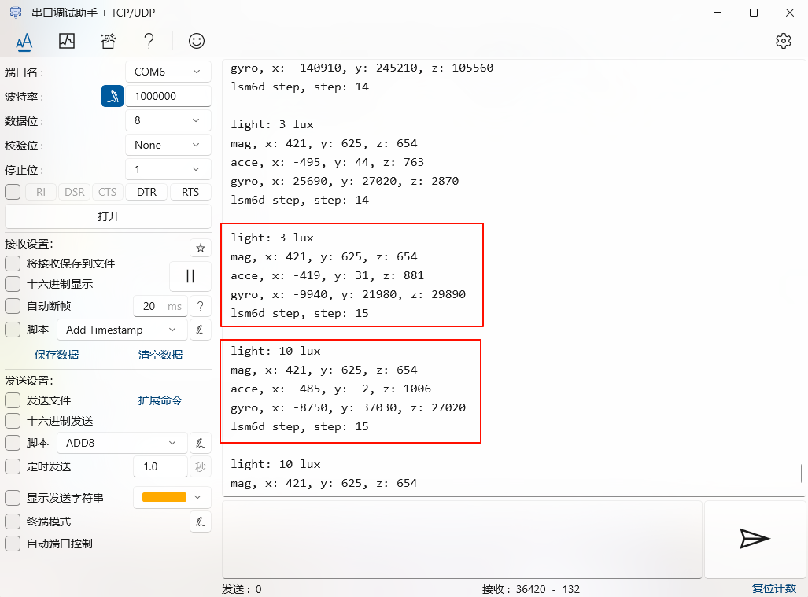
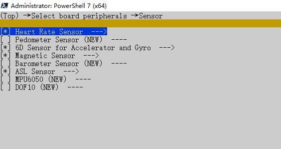
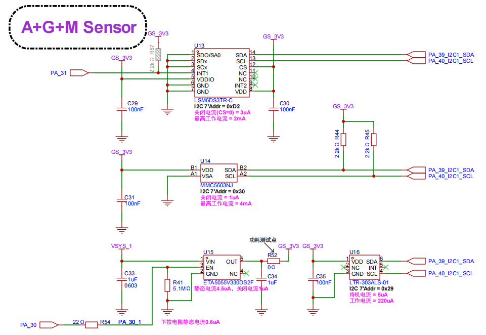

# sensor示例
Sensor（传感器）是物联网重要的一部分，“Sensor 之于物联网”就相当于“眼睛之于人类”。人类如果没有了眼睛就看不到这大千的花花世界，对于物联网来说也是一样。已经有大量的 Sensor 被开发出来供开发者选择了，如：加速度计(Accelerometer)、磁力计(Magnetometer)、陀螺仪(Gyroscope)、气压计(Barometer/pressure)、湿度计(Humidometer)等。

## 传感器类型与介绍
* LTR303传感器、MMC56X3传感器、LSM6DS传感器
* SiFli-SDK 目前基于 RT-Thread，因此外设方面API与RT-Thread 保持一致。详细的API使用说明可以参考 [RT-Thread sensor API](https://www.rt-thread.org/document/site/#/rt-thread-version/rt-thread-standard/programming-manual/device/sensor/sensor) 文档。在接下来的示例中，我们会逐步讲解每个API的使用方法。

## 例程的使用
### 编译和烧录
切换到例程project目录，运行scons命令执行编译：
```
scons --board=yellow_mountain -j8
```
执行烧写命令：
```
build_yellow_mountain_hcpu\uart_download.bat
```
按提示选择端口即可进行下载：
```none
please input the serial port num:6
```

#### 例程输出结果展示:
* 烧写完成串口打印各传感器数据


#### sensor配置流程

* 在menuconfig中打开相应传感器和`I2C1`

```
scons --board=yellow_mountain --menuconfig
```



## 硬件连接
我们查看一下立创黄山派的原理图，发现各传感器都是使用`PA_39_I2C1_SDA` 与`PA_40_I2C1_SLC`进行数据的接收与发送,外设总线使用的是`I2C1`。

## 初始化传感器
想要初始化传感器，我们需要一个初始化函数，在工程中我们有如下代码：
```c
static void sensors_init(struct rt_sensor_config *cfg)
{
    cfg->intf.dev_name = "i2c1";
    rt_hw_ltr303_init("ltr303", cfg);
    rt_hw_mmc56x3_init("mmc56x3", cfg);

    cfg->intf.user_data = (void *)LSM6DSL_ADDR_DEFAULT;
    cfg->irq_pin.pin = RT_PIN_NONE;
    rt_hw_lsm6dsl_init("lsm6d", cfg);
}
```

## 硬件配置
下面主要对具体I2C通信的引脚`PA_39`和`PA_40`设置为上拉模式
```c
static void board_io_init(void)
{
    HAL_PIN_Set(PAD_PA40, I2C1_SCL, PIN_PULLUP, 1);
    HAL_PIN_Set(PAD_PA39, I2C1_SDA, PIN_PULLUP, 1);
}
```

## 打开与配置传感器
```c
static void open_and_config_devices(rt_device_t *ltr303_dev, rt_device_t *mmc56x3_dev,
                                    rt_device_t *lsm6d_dev, rt_device_t *lsm6d_gyro_dev, rt_device_t *lsm6d_step_dev)
{
    *ltr303_dev = rt_device_find("li_ltr303");
    if (*ltr303_dev == RT_NULL)
        rt_kprintf("Can't find device:%s\n", "ltr303");
    else {
        rt_err_t ret = rt_device_open(*ltr303_dev, RT_DEVICE_FLAG_RDONLY);
        if (ret != RT_EOK)
            rt_kprintf("open device failed! err: %d\n", ret);
        rt_device_control(*ltr303_dev, RT_SENSOR_CTRL_SET_POWER, (void *)RT_SENSOR_POWER_NORMAL);
    }

    *mmc56x3_dev = rt_device_find("mag_mmc56x3");
    if (*mmc56x3_dev == RT_NULL)
        rt_kprintf("Can't find device:%s\n", "mmc56x3");
    else {
        rt_err_t ret = rt_device_open(*mmc56x3_dev, RT_DEVICE_FLAG_RDONLY);
        if (ret != RT_EOK)
            rt_kprintf("open device failed! err: %d\n", ret);
    }

    *lsm6d_dev = rt_device_find("acce_lsm");
    *lsm6d_gyro_dev = rt_device_find("gyro_lsm");
    *lsm6d_step_dev = rt_device_find("step_lsm");
    if (*lsm6d_dev == RT_NULL || *lsm6d_gyro_dev == RT_NULL || *lsm6d_step_dev == RT_NULL)
        rt_kprintf("Can't find device:%s\n", "lsm6d");
    else {
        rt_err_t ret = rt_device_open(*lsm6d_dev, RT_DEVICE_FLAG_RDONLY);
        ret += rt_device_open(*lsm6d_gyro_dev, RT_DEVICE_FLAG_RDONLY);
        ret += rt_device_open(*lsm6d_step_dev, RT_DEVICE_FLAG_RDONLY);
        if (ret != RT_EOK)
            rt_kprintf("open device failed! err: %d\n", ret);
        rt_device_control(*lsm6d_dev, RT_SENSOR_CTRL_SET_ODR, (void *)1660);
        rt_device_control(*lsm6d_gyro_dev, RT_SENSOR_CTRL_SET_ODR, (void *)1660);
    }
}
```
* 查找传感器应用程序根据传感器设备名称获取设备句柄，进而可以操作传感器设备，查找设备函数如：`*ltr303_dev = rt_device_find("li_ltr303");`<br>
* 打开传感器通过设备句柄，应用程序可以打开和关闭设备，打开设备时，会检测设备是否已经初始化，没有初始化则会默认调用初始化接口初始化设备。通过如下函数打开设备`rt_err_t ret = rt_device_open(*lsm6d_dev, RT_DEVICE_FLAG_RDONLY);`<br>
* 设备模式标志参数支持下列参数：
```c
#define RT_DEVICE_FLAG_RDONLY       0x001     /* 标准设备的只读模式，对应传感器的轮询模式 */
#define RT_DEVICE_FLAG_INT_RX       0x100     /* 中断接收模式 */
#define RT_DEVICE_FLAG_FIFO_RX      0x200     /* FIFO 接收模式 */
```
传感器数据接收和发送数据的模式分为 3 种：中断模式、轮询模式、FIFO 模式。在使用的时候，这 3 种模式只能选其一， 在这使用以只读及轮询模式打开传感器设备如：`rt_err_t ret = rt_device_open(*ltr303_dev, RT_DEVICE_FLAG_RDONLY);`
* 控制传感器设备通过命令控制字，应用程序可以对传感器设备进行配置，通过如下函数完成：`rt_device_control(*ltr303_dev, RT_SENSOR_CTRL_SET_POWER, (void *)RT_SENSOR_POWER_NORMAL);`
命令控制字目前支持以下几种命令控制字
```c
#define  RT_SENSOR_CTRL_GET_ID        /* 读设备ID */
#define  RT_SENSOR_CTRL_GET_INFO      /* 获取设备信息 */
#define  RT_SENSOR_CTRL_SET_RANGE     /* 设置传感器测量范围 */
#define  RT_SENSOR_CTRL_SET_ODR       /* 设置传感器数据输出速率，unit is HZ */
#define  RT_SENSOR_CTRL_SET_POWER     /* 设置电源模式 */
#define  RT_SENSOR_CTRL_SELF_TEST     /* 自检 */
```
## 传感器数据采集与打印
* 读取数据可调用读取传感器接收到的数据函数如：`res = rt_device_read(ltr303_dev, 0, &ltr303, 1);`，以循环的模式读取当前数据并打印出来。
```c
static void sensors_loop(rt_device_t ltr303_dev, rt_device_t mmc56x3_dev,
                        rt_device_t lsm6d_dev, rt_device_t lsm6d_gyro_dev, rt_device_t lsm6d_step_dev)
{
    struct rt_sensor_data ltr303, mmc56x3, lsm6d_acce, lsm6d_gyro, lsm6d_step;
    rt_size_t res;
    
    res = rt_device_read(ltr303_dev, 0, &ltr303, 1);
    if (res != 1)
        rt_kprintf("read data failed!size is %d\n", res);
    else
        rt_kprintf("light: %d lux\n", ltr303.data.light);

    res = rt_device_read(mmc56x3_dev, 0, &mmc56x3, 1);
    if (res != 1)
        rt_kprintf("read data failed!size is %d\n", res);
    else
        rt_kprintf("mag, x: %d, y: %d, z: %d\n", mmc56x3.data.mag.x, mmc56x3.data.mag.y, mmc56x3.data.mag.z);

    res = rt_device_read(lsm6d_dev, 0, &lsm6d_acce, 1);
    if (res != 1)
        rt_kprintf("read data failed!size is %d\n", res);
    else
        rt_kprintf("acce, x: %d, y: %d, z: %d\n", lsm6d_acce.data.acce.x, lsm6d_acce.data.acce.y, lsm6d_acce.data.acce.z);

    res = rt_device_read(lsm6d_gyro_dev, 0, &lsm6d_gyro, 1);
    if (res != 1)
        rt_kprintf("read data failed!size is %d\n", res);
    else
        rt_kprintf("gyro, x: %d, y: %d, z: %d\n", lsm6d_gyro.data.gyro.x, lsm6d_gyro.data.gyro.y, lsm6d_gyro.data.gyro.z);

    res = rt_device_read(lsm6d_step_dev, 0, &lsm6d_step, 1);
    if (res != 1)
        rt_kprintf("read data failed!size is %d\n", res);
    else
        rt_kprintf("lsm6d step, step: %d\n", lsm6d_step.data.step);

    rt_thread_mdelay(100);
    rt_kprintf("\n");
    
}
```


      
