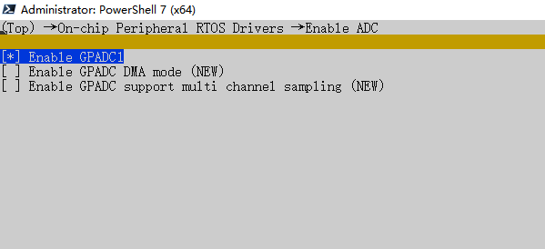
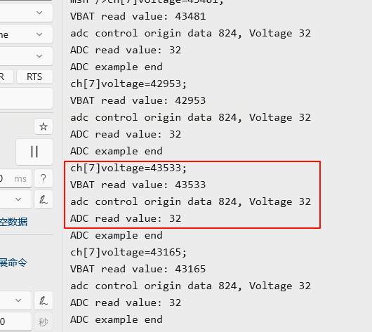
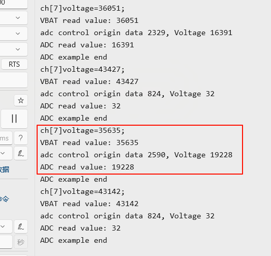
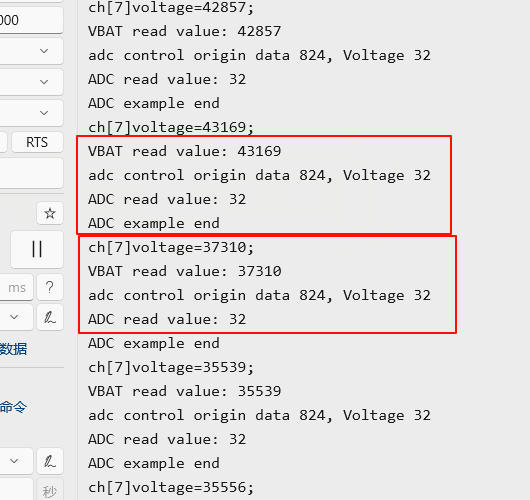
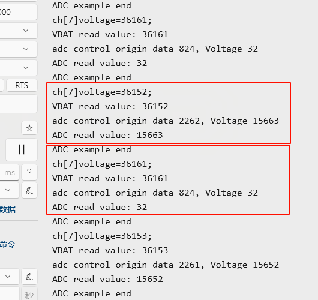
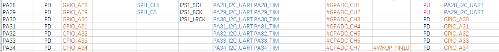

# ADC示例
ADC(Analog-to-Digital Converter) 指模数转换器。是指将连续变化的模拟信号转换为离散的数字信号的器件。真实世界的模拟信号，例如温度、压力、声音或者图像等，需要转换成更容易储存、处理和发射的数字形式。模数转换器可以实现这个功能，在各种不同的产品中都可以找到它的身影。
## ADC API 概述
SiFli-SDK 目前基于 RT-Thread，因此外设方面API与RT-Thread 保持一致。详细的API使用说明可以参考 [RT-Thread ADC API](https://www.rt-thread.org/document/site/#/rt-thread-version/rt-thread-standard/programming-manual/device/adc/adc) 文档。在接下来的示例中，我们会逐步讲解每个API的使用方法。

## 例程的使用
### 编译和烧录
此例程中用到了adc，在采用RT-Thread操作系统，adc外设会虚拟成了一个rt_device来进行读写操作，此时需要确认所在路径下`rtconfig.h`文件中是否包含了下面3个宏：

```c
#define BSP_USING_ADC 1
#define BSP_USING_ADC1 1
#define RT_USING_ADC 1
```
只有包含了上面三个宏，在`sifli_adc_init`函数中才会通过`rt_hw_adc_register`函数注册`bat1`这个rt_device，后面该设备才能`rt_device_find`和`rt_device_control`成功。

在终端执行`scons --board=yellow_mountain --menuconfig`后，使用⇧和⇩方向键在不同菜单项间移动，按Enter键进入子菜单，进`On-chip Peripheral RTOS Drivers`->`Enable ADC` 选择GPADC1，Space选中菜单项，按D保存并退出menuconfig，具体配置如下图：<br>



切换到例程project目录，运行scons命令执行编译：

```
scons --board=yellow_mountain -j8
```
运行`build_yellow_mountain_hcpu\uart_download.bat`，按提示选择端口即可进行下载：
```
build_yellow_mountain_hcpu\uart_download.bat

Uart Download

please input the serial port num:5
```

### 例程输出结果展示:
* 接入电池前读取的电压log <br>

   * 按下KEY1按键后log<br>


* 接入电池后读取的电压log<br>

   *  按下KEY1按键后log<br>


log中打印value值原始寄存器值，Voltage是转换后的mV电压

### ADC配置流程

ADC的输入口为固定的IO口，如下图:
52芯片ADC CH1-7分布，对应软件配置的Channel0-6，电压输入范围是0-3.3V；最后一路CH8(Channel 7)，内部通过分压电阻已经连接到VBAT引脚，外部不可以用电阻分压，输入范围是0-4.7V，建议用于电池电压测量。


首先增加宏定义，ADC1的设备，在`rt_hw_adc_register`函数内被注册为bat1为固定名称不能随便改动，使用ADC1时注册`bat1`即可。
我们使用两个通道来演示ADC的两种读取方式，其中`BAT_CHANNEL`为BAT检测引脚ADC通道号，内部连接连接到VBAT引脚，对应黄山派的电池输入引脚；`ADC_CHANNEL`为PA_34，使用CH7，在黄山派上作为按键默认被拉低，按下时经过分压电阻被拉高到VBAT

```c
#define ADC_DEV_NAME        "bat1"      /* ADC name */
#define BAT_CHANNEL 7       // BAT检测引脚ADC通道号
#define ADC_CHANNEL 6       // PA_34引脚ADC通道号

static rt_device_t s_adc_dev;
static rt_adc_cmd_read_arg_t read_arg;
void adc_example(void)
{
    rt_err_t r;

    /* find device */
    s_adc_dev = rt_device_find(ADC_DEV_NAME); 
    read_arg.channel = BAT_CHANNEL;
    r = rt_adc_enable((rt_adc_device_t)s_adc_dev, read_arg.channel);
    if (r != RT_EOK)
    {
        rt_kprintf("ADC enable failed\n");
        return;
    }
    
    rt_uint32_t value = rt_adc_read((rt_adc_device_t)s_adc_dev, BAT_CHANNEL);
    if (value == RT_ERROR)
    {
        rt_kprintf("ADC read failed\n");
        return;
    }
    rt_kprintf("VBAT read value: %d\n", value);                       // 打印PA_34读取的值
    rt_adc_disable((rt_adc_device_t)s_adc_dev, read_arg.channel);    // 禁用ADC通道
    HAL_PIN_Set_Analog(PAD_PA28, 1);                                 // 设置PA28为模拟输入模式
    read_arg.channel = ADC_CHANNEL;                                  // 设置ADC通道
    r = rt_adc_enable((rt_adc_device_t)s_adc_dev, read_arg.channel); // 使能ADC通道
    if (r != RT_EOK)
    {
        rt_kprintf("ADC enable failed\n");
        return;
    }
    
    value = rt_device_control((rt_device_t)s_adc_dev, RT_ADC_CMD_READ, &read_arg.channel);
    if (value == RT_ERROR)
    {
        rt_kprintf("ADC read failed\n");
        return;
    }
    rt_kprintf("ADC read value: %d\n", read_arg.value); // 打印ADC读取的值

    rt_kprintf("ADC example end\n");
}
```
在mian函数的循环中，加入对adc_example的调用，编译后烧录到设备中，可以在串口工具中看到可以周期性打印电池电压，和按键电压，我们按下按键后，按键所连接的ADC电压也会正常变高。

## 异常诊断
* 程序运行死机，log如下
```c
   Start adc demo!
   Assertion failed at function:rt_adc_enable, line number:144 ,(dev)
   Previous ISR enable 0
```
原因：  
`BSP_USING_ADC1`没有定义，导致`rt_hw_adc_register`函数没有注册`"bat1"`，`rt_device_find`该设备时Assert死机  
确保`rtconfig.h`文件中包含了下面3个宏：
```c
#define BSP_USING_ADC 1
#define BSP_USING_ADC1 1
#define RT_USING_ADC 1
```
* ADC采样的电压值不对
1. 检查ADC硬件是否连接正确，ADC采样的通道为固定IO口，不能任意指定，具体CH0-7为哪个IO，参照芯片手册  
2. ADC输入电压范围为0V - 参考电压（52默认为3v3），不能超出输入范围  
* ADC精确度不够
1. ADC校准参数是否获取和使用
2. 分压电阻的精度是否达到要求
3. ADC参考电压是否稳定和是否有过大纹波(具体参考ADC电压参考芯片手册) 

