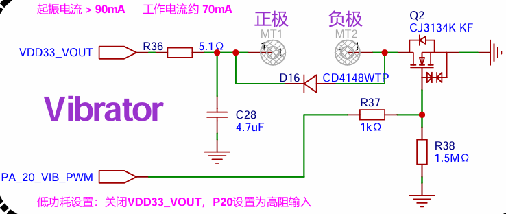

# GPIO 示例
* 源码路径：yellow_mountain_example/gpio
芯片上的引脚一般分为4类：电源、时钟、控制与 I/O，I/O 口在使用模式上又分为 General Purpose Input Output（通用输入 / 输出），简称 GPIO，与功能复用 I/O（如 SPI/I2C/UART 等）。
## GPIO API介绍
SiFli-SDK 目前的基于 RT-Thread，对于大部分外设都已经适配了RT-Thread的设备框架，熟悉RT-Thread的开发者可以直接跳过该部分教程，直接使用。GPIO设备在RT-Thread中被抽象为PIN设备，具体介绍可以参考官方文档[RT-Thread GPIO API](https://www.rt-thread.org/document/site/#/rt-thread-version/rt-thread-standard/programming-manual/device/pin/pin) 。在接下来的示例中，我们会逐步讲解每个API的使用方法。

接下来的示例中，我们会逐步讲解每个API的使用方法。
## 硬件连接
### GPIO输入输出
使用黄山派的PA20引脚进行演示，该引脚在黄山派上是预留给马达控制使用，也可以控制其它外部需要比较大电流工作的设备。



### GPIO中断
黄山派，板载了两个按键，其中PA_43为完全独立的用户按键；PA_34为硬件复位按键，拉高10S可以强制复位芯片，同时PA_34还连接了充电芯片的中断引脚，在电源状态发生变化时会有终端产生。因此我们使用PA_43作为中断代码演示。


## 例程的使用
### 编译和烧录
在文件中增加`#include <board.h> `如果不包含，可能会遇到错误提示没有定义.
如果还有错误检查menuconfig中的配置，在终端执行`scons --board=yellow_mountain --menuconfig`后，使用⇧和⇩方向键在不同菜单项间移动，按Enter键进入子菜单配置，Space选中菜单项，按D保存并退出menuconfig，具体配置如下图：

 
 
切换到例程project目录，运行scons命令执行编译：

```
scons --board=yellow_mountain -j8
```

运行`build_yellow_mountain_hcpu\uart_download.bat`，按提示选择端口即可进行下载：

```
build_yellow_mountain_hcpu\uart_download.bat

Uart Download

please input the serial port num:5
```

### 例程输出结果展示:
* log输出:
```
    \ | /
    - SiFli Corporation
    / | \     build on May 16 2025, 2.3.5 build 1429dedf
    2020 - 2022 Copyright by SiFli team
    mount /dev sucess
    [I/drv.rtc] PSCLR=0x80000100 DivAI=128 DivAF=0 B=256
    [I/drv.rtc] RTC use LXT RTC_CR=00000001
    [I/drv.rtc] Init RTC, wake = 0
    [I/drv.audprc] init 00 ADC_PATH_CFG0 0x606
    [I/drv.audprc] HAL_AUDPRC_Init res 0
    [I/drv.audcodec] HAL_AUDCODEC_Init res 0
    call par CFG1(3313)
    fc 9, xtal 2000, pll 2094
    call par CFG1(3313)
    fc 7, xtal 2000, pll 1680
    GPIO example
    msh />PIN 20 state: 1
    PIN 20 state: 0
    GPIO example end
    Waiting!
    Waiting!
```
* 按键按下和释放:
```
    KEY2 pressed
    Waiting!
    Waiting!
    KEY2 released

```
## 例程说明
增加宏定义`#define PIN 20`和`#define KEY2 43`sf32lb52系列芯片，引脚编号与硬件pad相同，也就是说PA_20和PA_43可以直接写20和43.

### GPIO输入输出硬件配置 
新增一个`example_gpio`函数，对具体引脚进行配置。首先配置IO为输出模式，并设置为高电平，然后读取引脚状态并打印，然后将硬件设置为低电平并再次读取打印。
```C
void example_gpio(void)
{
    rt_uint8_t pin_state = 0;
    rt_kprintf("GPIO example\n");
    // 初始化GPIO引脚
    rt_pin_mode(PIN, PIN_MODE_OUTPUT);                // 配置为输出模式
    rt_pin_write(PIN, PIN_HIGH);                      // 设置引脚高电平
    rt_thread_mdelay(10);                             // 延时10ms
    pin_state = rt_pin_read(PIN);                     // 读取引脚状态
    rt_kprintf("PIN %d state: %d\n", PIN, pin_state); // 打印引脚状态
    rt_pin_write(PIN, PIN_LOW);                       // 设置引脚低电平
    rt_thread_mdelay(10);                             // 延时10ms
    pin_state = rt_pin_read(PIN);                     // 读取引脚状态
    rt_kprintf("PIN %d state: %d\n", PIN, pin_state); // 打印引脚状态
    rt_kprintf("GPIO example end\n");
}
```
在main函数中增加对`example_gpio`的调用
```C
    int main(void)
    {
        example_gpio();
        while (1)
        {
            rt_kprintf("Waiting!\n");
            rt_thread_mdelay(5000);
        }
        return 0;
    }
```
### GPIO中断硬件配置
在`example_gpio`函数中增加中断引脚的配置，并使能中断。根据原理图可以知道，PA_43默认是被外部拉低到GND的，按下时会拉高到VBAT。其中`key2_irq`为中断回调函数，当中断产生时会调用。

```C
    rt_pin_mode(KEY2, PIN_MODE_INPUT);                                       // 配置为输入模式
    rt_pin_attach_irq(KEY2, PIN_IRQ_MODE_RISING_FALLING, key2_irq, RT_NULL); // 配置中断回调函数，上升和下降沿触发中断
    rt_pin_irq_enable(KEY2, PIN_IRQ_ENABLE);                                 // 使能中断
```
新建一个函数`key2_irq`，处理中断，产生中断时读取IO的电平来判断是按下还是抬起，从原理图知道按下时为1，释放时为0
```C
    // 按键中断回调
    void key2_irq(void *args)
    {
    
    if (rt_pin_read(KEY2) == 1)
    {
        rt_kprintf("KEY2 pressed\n"); // 打印按键按下
    }
    else
    {
        rt_kprintf("KEY2 released\n"); // 打印按键释放
    }
    }
```